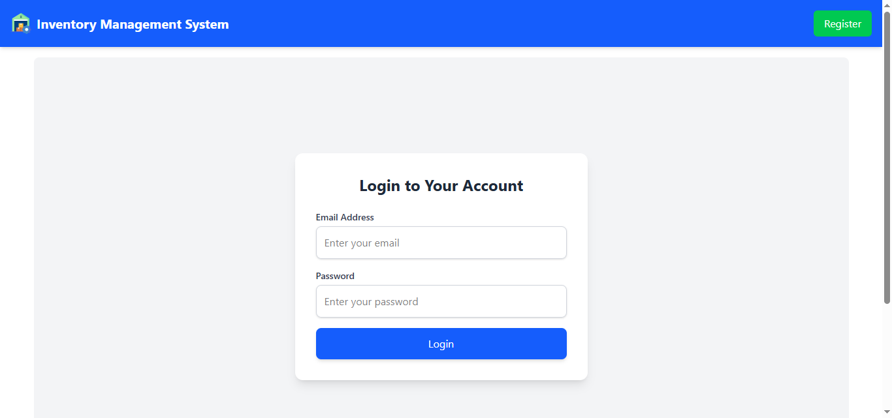
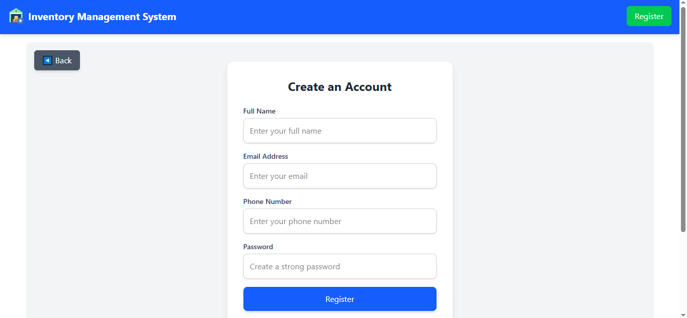
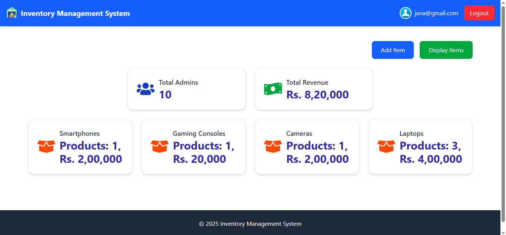
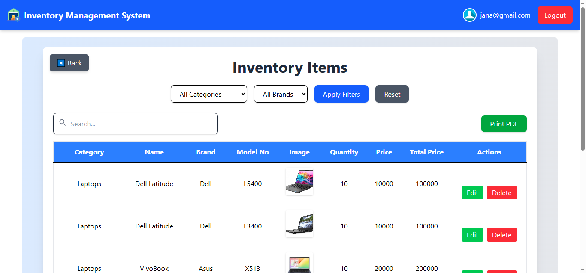

# Inventory Management Web Application

## Overview
This is an Inventory Management Web Application built with **React/Vite** for the frontend and **Spring Boot (Java)** for the backend. The application allows users to manage inventory items, apply filters, update or delete records, and generate inventory reports in PDF format.

## Features
- **View Inventory Items**: Display all items in the inventory.
- **Filter Items**: Filter inventory by category and brand.
- **Edit Item**: Update details of inventory item.
- **Delete Item**: Remove items from the inventory.
- **Search**: Search inventory items by name, category, or brand.
- **PDF Report**: Generate a PDF report for the inventory.
- **Responsive Design**: The UI is designed to work well on different screen sizes.

## Screenshots

Here are some screenshots of the application in action:

1. **Login Page:**

   

2. **Register Page:**

   

3. **Dashboard:**

   

4. **Inventory List Page:**

   

## Tech Stack
- **Frontend**: React, Vite
- **Backend**: Spring Boot (Java)
- **Database**: MySQL Database
- **PDF Generation**: jsPDF & jsPDF-AutoTable

